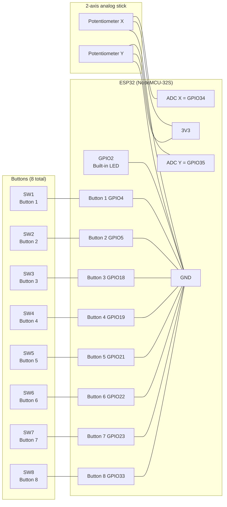

# esp32-gamepad

This project turns an ESP32 into a BLE HID gamepad for browsers and other host devices.

## Wiring overview

The code expects:

- 8 pushbuttons on GPIO inputs with internal pull-up enabled
- each button is active LOW, so the input is pulled to GND when pressed
- 2 potentiometers or a joystick module connected to ADC inputs for X and Y axes
- built-in LED on GPIO2 to show connection state

### Option 1: Printable ASCII schematic

```text
ESP32 (NodeMCU-32S)
┌───────────────────────────────────────────────────────────────┐
│                                                               │
│   GPIO2 ──── LED ──── GND                                     │
│                                                               │
│   GPIO1 ──┐                                                   │
│           ├── Button 1 ── GND   (active LOW, pull-up enabled) │
│   GPIO2 ──┤                                                   │
│           ├── Button 2 ── GND                                 │
│   GPIO3 ──┤                                                   │
│           ├── Button 3 ── GND                                 │
│   GPIO4 ──┤                                                   │
│           ├── Button 4 ── GND                                 │
│   GPIO5 ──┤                                                   │
│           ├── Button 5 ── GND                                 │
│   GPIO6 ──┤                                                   │
│           ├── Button 6 ── GND                                 │
│   GPIO7 ──┤                                                   │
│           ├── Button 7 ── GND                                 │
│   GPIO8 ──┤                                                   │
│           ├── Button 8 ── GND                                 │
│   GPIO8 ──┘                                                   │
│           └── Button 8 ── GND                                 │
│                                                               │
│   ADC_X ─── Potentiometer X ── 3V3                            │
│             │                                                 │
│             └── GND                                           │
│                                                               │
│   ADC_Y ─── Potentiometer Y ── 3V3                            │
│             │                                                 │
│             └── GND                                           │
│                                                               │
│   3V3 ──── common supply for joystick/potentiometers          │
│   GND ─── common ground for all buttons and pots              │
│                                                               │
└───────────────────────────────────────────────────────────────┘
```

Typical button connection:

```text
GPIO ---- switch ---- GND
         ^ internal pull-up enabled
```

Typical potentiometer connection:

```text
3V3 ---- potentiometer ---- ADC input
          |
         GND
```

### Option 2: Mermaid schematic



## Example pin assignment: SNES-style layout

This example follows an old-school, SNES-like controller layout: two shoulder buttons, four face buttons, and a directional pad on one side of the controller. A classic analog stick is optional; for a simpler build, the X/Y axis can be made from two potentiometers or a thumb-stick module.

```text
      [Y]     [B]     [A]
       ^       ^       ^
       |       |       |
   Button 1  Button 2  Button 3

   [X]   [L]   [R]   [Start]
     ^     ^     ^      ^
     |     |     |      |
 Button 4  Button 5  Button 6  Button 7

             [D-PAD]
          [UP] [LEFT] [RIGHT] [DOWN]
             ^    ^     ^      ^
             |    |     |      |
          Button 8  Button 9  Button 10  Button 11
```

A practical ESP32 mapping for this controller style is:

| Function    | ESP32 GPIO | Notes                                                                     |
| ----------- | ---------- | ------------------------------------------------------------------------- |
| LED         | GPIO2      | Built-in LED status indicator                                             |
| Button A    | GPIO4      | Active LOW, internal pull-up enabled                                      |
| Button B    | GPIO5      | Active LOW                                                                |
| Button X    | GPIO18     | Active LOW                                                                |
| Button Y    | GPIO19     | Active LOW                                                                |
| L trigger   | GPIO21     | Active LOW                                                                |
| R trigger   | GPIO22     | Active LOW                                                                |
| Start       | GPIO23     | Active LOW                                                                |
| Select      | GPIO33     | Active LOW                                                                |
| D-pad Up    | GPIO34     | Active LOW, can also be mapped to analog input if using a joystick module |
| D-pad Down  | GPIO35     | Active LOW                                                                |
| D-pad Left  | GPIO36     | Active LOW                                                                |
| D-pad Right | GPIO39     | Active LOW                                                                |
| Axis X      | GPIO32     | ADC input for X axis                                                      |
| Axis Y      | GPIO33     | ADC input for Y axis                                                      |
| Power       | 3V3        | Supply for joystick or potentiometers                                     |
| Ground      | GND        | Shared ground for all buttons and joystick                                |

> Note: for a true SNES-style layout, the D-pad is usually implemented as four separate momentary buttons, not as a single analog direction pad. The analog axis inputs can be omitted if you prefer a purely digital controller.

> Recommended: keep GPIO2 free for the LED status output, avoid strapping pins like GPIO0, GPIO2, and GPIO15 for pushbuttons, and use ADC-capable inputs such as GPIO32 and GPIO35 for the joystick axes.

## Notes

- The script comments explicitly state that the buttons are connected to GPIO pins with internal pull-ups and behave as active LOW inputs.
- The two axes are read from ADC pin inputs using potentiometers or a joystick module.
- The LED on GPIO2 is used as the board status indicator for BLE connection state.

## Hardware summary

- Buttons: 8 x momentary switches, one per GPIO input, connected to GND when pressed
- Axes: 2 x analog potentiometer outputs (X and Y)
- Power: 3.3V and GND rail
- Indicator: GPIO2 LED
